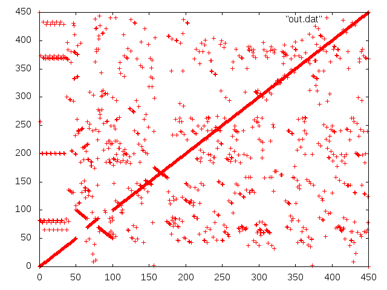

# Breakpoint visualisation

## Installation
Obtain the project source and compile.

    git clone https://git.lumc.nl/j.f.j.laros/breakpoints.git
    cd breakpoints/src
    make

## Usage
The `breakpoint` executable has two parameters, both FASTA files containing
only one record. Output is written to `stdout`.

    cd breakpoints/example
    ../src/breakpoints reference.fa mutated.fa > out.dat

Visualisation can be done with `gnuplot`, for example:

    cat << EOF | gnuplot
    set terminal png
    set output "out.png"
    plot "out.dat"
    EOF

The result will be something like this:

